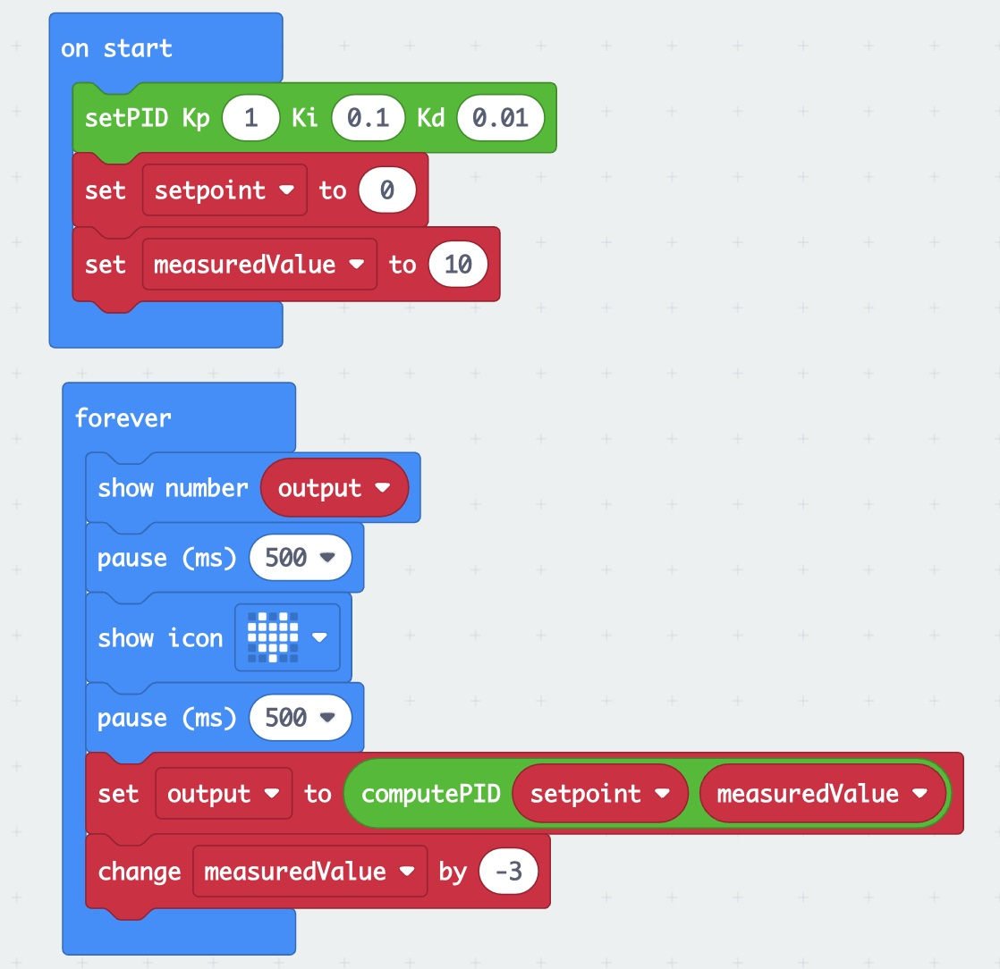

> Open this page at [https://cheangkokfook.github.io/pid/](https://cheangkokfook.github.io/pid/)
## Intro

Author: Cheang Kok Fook (Meekids Club)

At Meekids Club Learning Center, we believe in empowering young learners with the foundational tools and knowledge they need to dive into the world of robotics. With this vision in mind, we're thrilled to introduce our PID Control Extension for Microbit.

PID control is a fundamental concept in robotics, governing how robots can accurately and efficiently adjust their actions to achieve specific tasks. Whether it's a robot maintaining a steady speed, a drone stabilizing its flight, or a self-driving car adjusting its path, PID control is often at the heart of these operations.

Our extension simplifies the complexities of PID control, making it accessible and understandable for our young learners. Through hands-on experiments and real-world applications, students will grasp the principles of Proportional, Integral, and Derivative control, witnessing firsthand how these concepts bring robots to life.

Join us in this exciting journey as we explore the magic of robotics and inspire the next generation of innovators and creators at Meekids Club!

## Use as Extension

This repository can be added as an **extension** in MakeCode.

* open [https://makecode.microbit.org/](https://makecode.microbit.org/)
* click on **New Project**
* click on **Extensions** under the gearwheel menu
* search for **https://github.com/cheangkokfook/pid** and import

## Demo

## Edit this project

To edit this repository in MakeCode.

* open [https://makecode.microbit.org/](https://makecode.microbit.org/)
* click on **Import** then click on **Import URL**
* paste **https://github.com/cheangkokfook/pid** and click import

#### Metadata (used for search, rendering)

* for PXT/microbit

